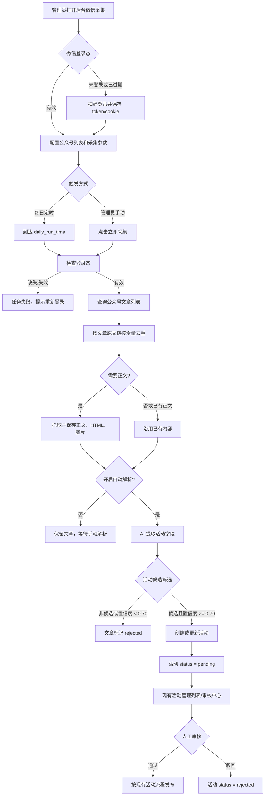

# 微信公众号文章自动获取、解析与审核操作手册

## 1. 文档目的

本文用于指导管理员使用平台的微信公众号采集功能，完成以下工作：

1. 登录并维护微信公众平台登录态。
2. 自动检测登录态是否仍然有效。
3. 配置公众号列表和每日增量采集任务。
4. 获取公众号文章列表及正文，并按文章链接增量去重。
5. 使用 AI 解析文章内容，提取活动信息。
6. 筛选适合进入“活动”栏目的文章，并以“待审核”状态加入现有活动管理列表。
7. 在活动管理或审核中心完成最终人工审核。

本文描述的是当前系统的实际行为。系统不会把所有微信公众号文章直接发布为活动，也不会为活动候选单独创建一个新的可视化筛选器。

## 2. 适用范围与角色

- 适用角色：拥有管理员权限的后台用户。
- 使用入口：后台管理控制台 → **微信采集**。
- 最终审核入口：后台管理控制台 → **活动**（活动管理），或 **审核中心** 中的活动类型。
- 运行环境：服务端需要可用的 Playwright Chromium；AI 解析需要当前项目配置的 AI runtime 和可用模型提供方。

公众号采集接口均受到管理员鉴权保护。普通用户不能配置账号、触发采集、查看采集文章或重试解析。

## 3. 一图理解完整流程



## 4. 首次使用前的准备

### 4.1 确认后台入口

登录后台后，在“活动运营”区域进入 **微信采集**。页面包含两类能力：

- **手动采集**：临时搜索一个公众号、获取文章、查看正文并导入。
- **每日增量采集**：维护长期公众号列表，按日获取新文章并自动解析。

### 4.2 确认浏览器运行环境

微信公众平台扫码登录由服务端 Playwright Chromium 承载。进入微信采集页后，先查看“运行环境”诊断：

- Chromium 可用：可以开始扫码登录。
- Chromium 缺失：登录任务无法启动，需要由部署人员在服务端补齐 Playwright Chromium 运行依赖，然后重启服务。

这项检查与浏览器页面能否在管理员电脑打开无关，关键是服务端运行环境是否完整。

### 4.3 确认 AI 解析能力

若需要自动解析，或通过管理员接口执行 AI 解析，项目必须已经配置可用的 AI 模型提供方。AI 不可用时，文章仍可以被采集和保存，但解析状态会进入 `failed`，不会自动生成活动。

## 5. 微信公众平台登录与 Token 自动验活

### 5.1 扫码登录

1. 打开 **微信采集**。
2. 查看运行环境状态为可用。
3. 点击 **开始登录**。
4. 使用微信扫描页面中的二维码。
5. 在手机端选择对应的公众号并确认登录。
6. 等待页面显示“扫码确认成功，登录态已安全保存”。
7. 刷新状态，确认凭据状态为“有效”。

登录成功后，服务端保存微信公众平台接口调用所需的 token 和 cookie。页面只显示脱敏 token、cookie 名称和更新时间，不显示完整凭据。

### 5.2 Token 验活默认规则

系统默认创建并启用一个每 12 小时检测一次的登录态检查任务：

| 配置           | 默认值          | 说明                                     |
| -------------- | --------------- | ---------------------------------------- |
| Token 自动验活 | 开启            | 独立于每日文章采集开关                   |
| 检测间隔       | 12 小时         | 可配置为 1–168 小时                      |
| 调度检查频率   | 每分钟检查一次  | 不是每分钟都请求微信接口，只有到期才检测 |
| 每日文章采集   | 关闭            | 首次配置时需要管理员明确开启             |
| 每日采集时间   | 03:30           | 使用配置时区                             |
| 默认时区       | `Asia/Shanghai` | 采集时间和验活时间均按服务端配置处理     |

Token 验活任务在服务启动后会立即尝试检查一次，之后由后台定时器每分钟判断是否到达下一次检测时间。服务重启、登录态更新或真实接口调用后，页面会刷新到最新状态。

### 5.3 页面上的登录态状态

| 状态     | 含义                                                 | 管理员操作                                 |
| -------- | ---------------------------------------------------- | ------------------------------------------ |
| 有效     | 最近一次检查确认微信公众平台登录态可用               | 可以采集和抓正文                           |
| 已过期   | 微信返回 `invalid session`、登录超时或等价的失效信号 | 重新点击“开始登录”扫码                     |
| 检查中   | 正在请求微信公众平台                                 | 等待状态刷新，不要重复启动登录             |
| 未配置   | 服务端没有完整 token/cookie                          | 执行扫码登录                               |
| 检查失败 | 当前请求无法确认状态，例如网络超时                   | 先刷新或稍后重试；连续失败时检查服务端网络 |

Token 验活只能发现失效，不能替管理员自动重新扫码。检测到过期后，必须重新完成一次扫码登录。

### 5.4 安全要求

- 不要把完整 token、cookie、`credentials.json` 内容粘贴到工单、聊天或日志中。
- 登录凭据保存在服务端 `server/data/wechat-mp/credentials.json`，浏览器 profile 位于同目录下的 `browser-profile`。
- 该目录属于运行时敏感数据，部署、迁移或备份时应限制文件权限。
- 页面和错误处理会尽量脱敏 token/cookie；如果日志中出现完整凭据，应立即轮换登录态并检查日志访问权限。

## 6. 配置每日增量采集

### 6.1 打开增量采集区域

在 **微信采集** 页面找到 **每日增量采集**。首次打开时，系统会显示当前保存的配置、账号数量、最近任务和新增文章数。

### 6.2 建议的首次配置顺序

建议按以下顺序操作：

1. 保持 **Token 自动验活** 开启，检测间隔先使用 12 小时。
2. 先维护公众号列表，不要立即开启每日采集。
3. 保持保守的访问等待参数。
4. 开启“抓取正文”和“自动解析”。
5. 先点击 **立即采集** 做一次人工观察。
6. 确认运行完成、文章入库、解析和活动筛选结果正常后，再开启每日定时采集。

### 6.3 采集设置

| 设置项         | 默认值          | 作用                                       |
| -------------- | --------------- | ------------------------------------------ |
| 开启每日采集   | 关闭            | 开启后，系统在每日配置时间触发一次增量任务 |
| 每日开始时间   | `03:30`         | 使用 `HH:mm`，例如 `07:05`                 |
| 时区           | `Asia/Shanghai` | 决定每日任务在哪个本地时间触发             |
| Token 自动验活 | 开启            | 控制独立的登录态检查任务                   |
| Token 检测间隔 | `12` 小时       | 有效范围 1–168 小时                        |
| 每页文章数     | `20`            | 有效范围 1–100                             |
| 最大页数       | `1`             | 有效范围 1–5；页数越多，访问时间越长       |
| 抓取正文       | 开启            | 在文章列表之外继续抓正文、HTML 和图片      |
| 自动解析       | 开启            | 有正文后自动调用 AI 并执行活动候选筛选     |

保存配置后，页面会重新读取后端归一化后的值。无效时区会回退到 `Asia/Shanghai`；时间会标准化为两位小时和分钟。

### 6.4 访问等待参数

系统在批量采集时保留随机等待，以降低连续访问带来的风险。默认值如下：

| 场景           | 默认值      | 说明                                               |
| -------------- | ----------- | -------------------------------------------------- |
| 相邻公众号查询 | `95–125` 秒 | 处理不同公众号之间的查询间隔                       |
| 自动翻页       | `10–25` 秒  | 页面之间暂停；当前单独保存的页面暂停值默认是 10 秒 |
| 相邻正文抓取   | `10–20` 秒  | 多篇文章连续抓正文时使用                           |

不要为了追求速度把等待时间改成极短值。采集任务可能因此更容易触发微信侧限制，也可能导致任务耗时和失败率波动。

### 6.5 添加公众号

可以手动填写，也可以上传列表文件。

手动添加时建议填写：

- 公众号名称：用于识别和展示。
- `fakeid`：从手动搜索结果中获取的公众号唯一标识；长期任务建议填写。
- 关键词：可填写多个关键词，使用逗号分隔。当前自动任务优先使用第一个关键词查询文章。
- 是否启用：只有启用的账号参与每日采集。

列表文件支持 `.json`、`.csv`、`.tsv` 和 `.txt`。常用 CSV 示例：

```csv
公众号名称,fakeid,关键词,启用
求是学院,fakeid-example,"讲座,报名",是
浙江大学本科生院,fakeid-example-2,"通知,竞赛",是
```

简单文本行也可以使用以下格式：

```text
公众号名称,fakeid,别名,关键词
求是学院,fakeid-example,qiushi,讲座
```

导入具有幂等性：如果名称或 `fakeid` 已存在，系统更新原账号，不会重复创建账号记录。

### 6.6 先手动运行一次

完成账号和配置后：

1. 点击 **立即采集**。
2. 页面会创建一条运行记录并在后台执行，接口返回状态通常为 `running`。
3. 等待页面刷新，查看任务状态、账号数、文章数、新增数、正文数和解析数。
4. 在文章列表中查看每篇文章的正文状态、解析状态和活动筛选状态。

同一时间只允许一个增量任务运行。重复点击时会提示任务正在运行，返回冲突状态；等待当前任务完成即可。

## 7. 自动采集、解析与入库规则

### 7.1 采集阶段

每日任务只处理已启用的公众号。每个账号使用以下配置：

- 账号自身的 `count_per_page`、`max_pages`（如果设置）。
- 否则使用全局的每页文章数和最大页数。
- 账号关键词列表的第一个关键词；没有关键词时获取该账号的文章列表。
- 自动任务固定不把公众号置顶或首篇内容作为普通增量文章强制加入，使用 `allowFirst: false`。

文章列表入库前会过滤不可信的链接。有效文章以公众号原文 `link` 为唯一键：

- 后续任务再次发现同一链接，不会创建重复文章。
- 已有记录但没有正文时，如果本次抓正文成功，会补齐正文。
- 已经解析完成的文章不会在每次重复采集时再次调用 AI。

### 7.2 正文阶段

开启“抓取正文”且文章还没有正文时，系统会抓取并保存：

- 正文纯文本。
- 清理后的正文 HTML。
- 正文图片列表。
- 文章封面及基本元数据。

正文抓取失败不会自动删除文章记录。该篇文章会保留在增量文章列表中，管理员可以先重试采集正文，或者在正文已经存在时直接重试解析。

### 7.3 AI 解析阶段

开启“自动解析”后，系统只对已经保存正文的文章调用 AI。解析输出包括：

- 活动名称、摘要和详情 HTML。
- 日期、结束日期、时间说明。
- 地点、主办方、面向对象。
- 活动分类及分类置信度。
- 志愿时长、综测/素质分等活动字段。
- 学院通知标记、通知类型、来源学院。
- 活动候选标记、活动候选置信度和判断理由。

文章正文最长按 20 万字符处理；AI prompt 实际向模型提供的正文会截取到约 15,000 字符，以控制解析请求规模。若模型返回失败，文章不会被当作活动写入，解析状态为 `failed`。

## 8. 活动候选智能筛选规则

### 8.1 筛选目标

系统在文章解析完成后立即执行一次活动候选筛选。筛选结果直接写入现有活动数据和活动管理列表，不创建额外的“智能筛选器”页面。

### 8.2 通过条件

一篇文章同时满足以下条件，才会被接入活动栏目：

1. AI 返回 `is_activity_candidate = true`。
2. AI 返回的 `activity_confidence >= 0.70`。
3. 文章有合法的公众号原文链接，能够作为活动来源链接。

判定倾向于以下参与型内容：

- 讲座、培训、比赛、招聘、志愿招募、交流活动。
- 有明确参与对象、时间安排、地点、报名方式或参与动作的通知。
- 读者可以据此采取报名、参加、提交作品等行动的内容。

以下内容通常不会进入活动栏目：

- 新闻报道和活动回顾。
- 成果展示、获奖报道和总结复盘。
- 政策说明、经验分享。
- 没有明确活动安排或参与动作的普通通知。

### 8.3 通过后的状态

通过筛选后，系统会创建或更新一条活动记录，并强制设置：

```text
events.status = pending
```

同时在增量文章记录中保存：

```text
activity_status = accepted
event_id = 对应活动 ID
activity_reason = AI 判断理由
```

活动不会因为自动筛选通过而直接公开。它必须经过现有人工审核流程。

### 8.4 未通过和失败状态

| 文章状态       | 说明                         | 后续动作                                 |
| -------------- | ---------------------------- | ---------------------------------------- |
| `not_screened` | 尚未完成活动候选筛选         | 检查是否已解析完成；必要时重试解析       |
| `accepted`     | 通过候选筛选，已关联活动     | 到活动管理或审核中心审核 `pending` 活动  |
| `rejected`     | 不是候选，或置信度低于 0.70  | 通常无需处理；可查看判断理由             |
| `failed`       | 候选判断通过，但活动写入失败 | 检查活动数据库错误或原文链接，再重试解析 |

如果 AI 判断为候选但置信度低于 `0.70`，系统仍会标记为 `rejected`，并记录“低于阈值”的原因。该阈值是后端固定业务规则，不在当前页面提供单独的可视化调节器。

## 9. 活动审核与发布

### 9.1 进入待审核活动

在后台进入以下任一入口：

- **活动运营 → 活动**：打开活动管理，将状态筛选为 **待审核**。
- **审核中心 → 活动**：按活动类型查看待审核内容。

通过自动筛选的公众号文章生成的活动会与其他活动一起显示，不需要切换到新的“公众号活动”页面。

### 9.2 人工审核清单

打开活动详情后，至少检查：

- 标题是否准确，是否保留了文章标题中的新闻性前缀。
- 活动日期、结束日期和时间是否真实；AI 无法判断时可能留空或使用文章日期。
- 地点是否包含校区、楼号、房间或线上平台。
- 主办方、面向对象和活动分类是否准确。
- 摘要和详情是否把报名、参与条件、截止时间等关键信息说清楚。
- 原文链接是否可访问。
- 封面和正文图片是否正常展示。
- 是否属于学院通知，以及来源学院和通知类型是否正确。

确认无误后，按照现有活动管理的审核操作通过或驳回。通过前可以编辑和补充时间、地点等 AI 无法可靠推断的字段。

### 9.3 重复活动处理

自动接入活动时，系统优先通过文章已关联的 `event_id`，其次通过原文 `link` 查找已有活动：

- 已有待审核或草稿活动：更新活动字段并保持 `pending`。
- 已有已通过或已驳回活动：不会自动覆盖人工审核状态。
- 没有匹配记录：创建新的 `pending` 活动。

因此，重复运行采集不会持续生成相同活动，但人工已经处理过的活动状态也不会被后台自动改回。

## 10. 手动采集与手动导入

手动采集适合临时验证某个公众号或补录单篇文章，不依赖每日任务是否开启。

### 10.1 获取文章

1. 在手动采集区域输入公众号名称。
2. 点击搜索，从候选列表中选择正确账号，确认名称和 `fakeid`。
3. 可选填关键词。
4. 设置获取数量和最大页数。
5. 如确有需要，再调整等待参数。
6. 点击 **获取文章**。
7. 从结果中选择目标文章，点击 **获取正文**。

如果通过名称无法唯一定位公众号，系统要求从候选结果中选择；不要仅凭相似名称直接导入。

### 10.2 导入类型

正文获取完成后，可以：

- **导入为文章**：先复用 `wechat_event_parse` 解析标题和摘要，再写入文章内容；默认状态为 `approved`，使用文章标签和文章分类默认值。
- **导入为活动**：先复用 `wechat_event_parse` 提取活动字段，再写入活动内容；导入 payload 默认状态为 `pending`，最终资源状态仍遵循现有审核权限规则，之后可在活动管理中补充和审核。

手动导入不再绕过 AI 解析链路。解析成功时，导入接口响应中的 `analysis.status` 为 `completed`，并返回任务、模型、活动候选判断和置信度摘要；AI 暂时不可用时，系统会记录失败审计并使用原始正文的确定性字段继续导入，`analysis.status` 为 `failed`。

只有写入 `events` 的内容才进入 `event_governance`：手动导入为活动，或其他通用活动创建成功后，后台会自动对新活动执行一次限定范围的治理扫描，并把建议写入 AI 治理队列；自动扫描只生成建议，不会替管理员自动通过、发布或应用修改。导入为文章不会因为 AI 判定为活动候选而隐式创建活动记录，如需进入活动治理，应明确选择 **导入为活动**。

当前资源导入调用如果没有明确指定 `resource_type`，默认按 **活动** 处理。这是为了兼容“未明确指定类型的调用从文章导入变成活动导入”的约定。需要导入普通文章时，应明确选择或传入文章类型。

手动导入不会绕过管理员审核要求：活动默认仍为 `pending`；文章导入是否直接为已通过取决于当前资源导入接口的既有约定，管理员应在导入后检查状态。

## 11. 状态、任务记录与监控

### 11.1 运行级状态

运行记录显示本次任务的整体情况：

- 触发来源：`manual` 或 `scheduled`。
- 任务状态：通常为 `running`、`completed` 或 `failed`。
- 公众号数量、文章总数、新增文章数。
- 成功抓取正文数、成功解析数。
- 正文抓取失败数、AI 解析失败数。
- 任务级错误信息。

任务显示 `completed` 不代表每篇文章都成功。还应同时查看文章级正文、解析和活动筛选状态。

### 11.2 文章级检查顺序

排查一篇文章时，按以下顺序看：

1. 是否有合法原文链接。
2. `content_status` 是否表示正文已抓取。
3. `extraction_status` 是否为 `completed`。
4. 是否存在 `extraction_error`。
5. `activity_status` 是否为 `accepted`、`rejected` 或 `failed`。
6. 若为 `accepted`，是否有 `event_id`。
7. 活动管理中是否存在对应 `pending` 活动。

### 11.3 常见文章级状态

| 字段                | 常见值         | 含义                         |
| ------------------- | -------------- | ---------------------------- |
| `content_status`    | `not_fetched`  | 只有文章元数据，尚未取得正文 |
| `content_status`    | `fetched`      | 正文已保存                   |
| `extraction_status` | `not_started`  | 尚未调用 AI                  |
| `extraction_status` | `processing`   | AI 解析进行中                |
| `extraction_status` | `completed`    | 已保存结构化解析结果         |
| `extraction_status` | `failed`       | 本次解析失败，可重试         |
| `activity_status`   | `not_screened` | 尚未完成活动候选判断         |
| `activity_status`   | `accepted`     | 已生成或关联活动             |
| `activity_status`   | `rejected`     | 未进入活动栏目               |
| `activity_status`   | `failed`       | 候选活动写入失败             |

## 12. 重试与故障排查

### 12.1 页面显示“Token 已过期”或接口返回 `invalid session`

原因：微信公众平台登录态失效，可能是 token/cookie 过期、微信侧主动失效或登录环境变化。

处理：

1. 停止重复点击采集。
2. 在微信采集页点击 **开始登录**。
3. 重新扫码并在手机端确认公众号。
4. 确认页面显示登录态“有效”。
5. 再次执行一次手动采集验证。

自动验活会把失效状态显示出来，但不会替代扫码登录。

### 12.2 登录按钮报 Chromium 缺失

原因：服务端没有安装 Playwright Chromium，或者部署环境缺少浏览器依赖。

处理：由部署人员按当前项目的 Node/Playwright 部署方式补齐 Chromium 及系统依赖，重启服务后再试。不要在生产服务器上随意更换 Playwright 版本或手动删除浏览器缓存目录。

### 12.3 任务为 `failed`，但文章列表没有新增

优先检查：

1. Token 状态是否为“有效”。
2. 启用账号是否为 0。
3. 账号 `fakeid` 是否正确。
4. 微信公众平台是否返回了登录或权限错误。
5. 任务错误信息是否为网络超时或接口限流。

如果任务在第一个账号就失败，整体任务可能会结束为 `failed`；如果单篇正文抓取失败，系统通常会保留文章元数据并继续处理后续文章。

### 12.4 文章已入库但没有正文

原因可能是正文抓取开关关闭、微信页面暂时无法访问、文章链接失效或抓取超时。

处理：

- 确认全局和账号级“抓取正文”均开启。
- 重新运行增量采集；已有文章无正文时会尝试补齐。
- 如果文章正文已经存在，直接使用文章列表中的 **重试解析**，无需重新抓正文。

### 12.5 解析状态为 `failed`

常见原因：AI provider 不可用、模型超时、返回不是合法 JSON、文章正文为空或正文内容不符合解析要求。

处理：

1. 确认 AI 模型配置和服务端网络。
2. 确认文章确实有正文。
3. 点击 **重试解析**。
4. 查看文章的 `extraction_error`，不要只看运行级“解析失败数”。

解析失败可以重试；成功后系统会继续执行活动候选筛选。

### 12.6 文章解析成功但没有出现在活动管理

这通常是正常的筛选结果，不一定是系统错误。检查：

- `activity_status` 是否为 `rejected`。
- `activity_reason` 是否说明文章是新闻、回顾、成果或缺少参与安排。
- `activity_confidence` 是否低于 `0.70`。
- AI 是否返回 `is_activity_candidate = true`。

只有通过候选条件的文章才会创建活动。没有通过的文章仍保留在微信公众号增量文章列表中，便于追溯。

### 12.7 文章显示 `accepted`，但活动管理中找不到

检查：

1. 文章是否有 `event_id`。
2. 活动管理是否使用了“待审核”状态筛选。
3. 审核中心是否选择了“活动”类型。
4. 数据库中是否存在该 `event_id`，以及活动是否被删除。

自动接入的活动默认是 `pending`，不会出现在只查看“已通过”的列表中。

### 12.8 点击立即采集提示任务正在运行

系统通过运行锁保证同一时间只有一个增量任务。等待当前任务完成后再操作；不要通过刷新页面或重复点击来启动第二个任务。

### 12.9 采集速度慢

这是默认的保守等待策略导致的预期现象，尤其是在公众号数量多、页数多或开启正文抓取时。优先减少每个账号的页数、分批维护账号，而不是大幅降低等待参数。

## 13. 推荐的日常操作清单

### 13.1 首次启用清单

- [ ] 运行环境显示 Chromium 可用。
- [ ] 完成扫码登录。
- [ ] Token 状态显示有效。
- [ ] Token 自动验活保持开启，间隔为 12 小时。
- [ ] 添加并检查公众号名称、`fakeid`、关键词和启用状态。
- [ ] 开启抓取正文和自动解析。
- [ ] 保持默认保守等待参数。
- [ ] 手动执行一次采集并确认运行完成。
- [ ] 检查至少一篇文章的正文、解析和活动候选状态。
- [ ] 在活动管理中确认通过筛选的活动为待审核。
- [ ] 确认流程正常后开启每日采集，并检查每日时间和时区。

### 13.2 每日巡检清单

- [ ] 登录态没有显示已过期或检查失败。
- [ ] 最近一次定时任务状态为 `completed`。
- [ ] 没有持续增长的正文抓取失败数或解析失败数。
- [ ] 新增活动候选已进入活动管理的待审核列表。
- [ ] 人工审核活动的日期、地点、报名信息和原文链接。
- [ ] 对新闻回顾类文章被筛掉的情况无需手动补入活动，除非业务上确实需要。

## 14. 管理员 API 参考

以下接口均位于 `/api` 下，并要求管理员登录。日常使用优先通过页面完成，接口主要用于联调、部署检查和故障排查。

### 14.1 登录和手动采集

| 方法   | 路径                               | 用途                                          |
| ------ | ---------------------------------- | --------------------------------------------- |
| `GET`  | `/admin/wechat-mp/status`          | 获取浏览器运行环境、登录信息和 Token 健康状态 |
| `POST` | `/admin/wechat-mp/login/start`     | 发起扫码登录                                  |
| `GET`  | `/admin/wechat-mp/login/status`    | 查询扫码登录进度                              |
| `POST` | `/admin/wechat-mp/login/cancel`    | 取消扫码登录                                  |
| `POST` | `/admin/wechat-mp/accounts/search` | 搜索公众号候选                                |
| `POST` | `/admin/wechat-mp/articles`        | 获取文章列表                                  |
| `POST` | `/admin/wechat-mp/article-content` | 获取指定文章正文                              |
| `POST` | `/admin/wechat-mp/parse`           | 解析已有正文                                  |
| `POST` | `/admin/wechat-mp/import-payload`  | 复用 AI 解析并构造文章或活动导入数据          |

### 14.2 每日增量采集

| 方法     | 路径                                         | 用途                                 |
| -------- | -------------------------------------------- | ------------------------------------ |
| `GET`    | `/admin/wechat-mp/ingest`                    | 获取配置、公众号、最近任务和文章总览 |
| `GET`    | `/admin/wechat-mp/ingest/settings`           | 获取增量采集配置                     |
| `PUT`    | `/admin/wechat-mp/ingest/settings`           | 保存增量采集配置                     |
| `GET`    | `/admin/wechat-mp/ingest/accounts`           | 获取公众号列表                       |
| `POST`   | `/admin/wechat-mp/ingest/accounts`           | 新增或更新公众号                     |
| `PUT`    | `/admin/wechat-mp/ingest/accounts/:id`       | 更新公众号                           |
| `DELETE` | `/admin/wechat-mp/ingest/accounts/:id`       | 删除公众号                           |
| `POST`   | `/admin/wechat-mp/ingest/accounts/import`    | 上传 JSON/CSV/TSV/TXT 账号列表       |
| `POST`   | `/admin/wechat-mp/ingest/run`                | 手动启动一次增量采集                 |
| `GET`    | `/admin/wechat-mp/ingest/runs`               | 查询运行记录                         |
| `GET`    | `/admin/wechat-mp/ingest/articles`           | 查询增量文章及解析、筛选状态         |
| `POST`   | `/admin/wechat-mp/ingest/articles/:id/parse` | 重试指定文章的 AI 解析和活动筛选     |

## 15. 数据与实现位置（供维护人员参考）

日常管理员不需要直接操作数据库。开发和部署人员排查问题时，可按以下位置定位：

- 后台页面：`src/components/Admin/WeChatMpImportManager.jsx`
- 后台导航和活动管理入口：`src/components/Admin/AdminDashboard.jsx`
- 微信登录、Token 验活、文章列表和正文服务：`server/src/services/wechatMpAdminService.js`
- 增量采集、调度、文章入库、AI 解析重试和活动筛选：`server/src/services/wechatMpScheduledIngestService.js`
- 文章/活动资源导入默认值：`server/src/services/wechatMpResourcePayloadService.js`
- 活动创建后的自动治理触发：`server/src/services/eventGovernanceTriggerService.js`
- AI 解析 prompt 和输出契约：`server/src/utils/wechat.js`
- 管理员接口：`server/src/controllers/wechatMpAdminController.js`、`server/src/routes/api.js`

增量采集使用以下 SQLite 表：

| 表                          | 用途                                     |
| --------------------------- | ---------------------------------------- |
| `wechat_mp_ingest_settings` | 单行全局配置                             |
| `wechat_mp_ingest_accounts` | 长期公众号列表和账号级覆盖配置           |
| `wechat_mp_ingest_articles` | 文章元数据、正文、解析结果和活动筛选结果 |
| `wechat_mp_ingest_runs`     | 每次手动或定时任务的运行记录             |
| `events`                    | 通过活动候选筛选后创建的现有活动记录     |

## 16. 版本与行为约定

当前流程的几个重要约定如下：

1. Token 自动验活默认开启，每 12 小时检测一次；每日文章采集默认关闭，需要管理员主动开启。
2. 活动筛选复用现有 AI 解析调用，在同一次解析结果中读取 `is_activity_candidate`、`activity_confidence` 和 `activity_reason`。
3. 活动候选阈值固定为 `0.70`；通过后直接写入现有活动管理数据，状态为 `pending`。
4. 不通过筛选的文章不删除，保留在增量文章列表中用于追溯。
5. 采集以公众号原文链接去重，重复运行不会重复创建同一文章或同一活动。
6. 未明确指定手动导入资源类型时，默认按活动导入；普通文章导入应明确指定文章类型。
