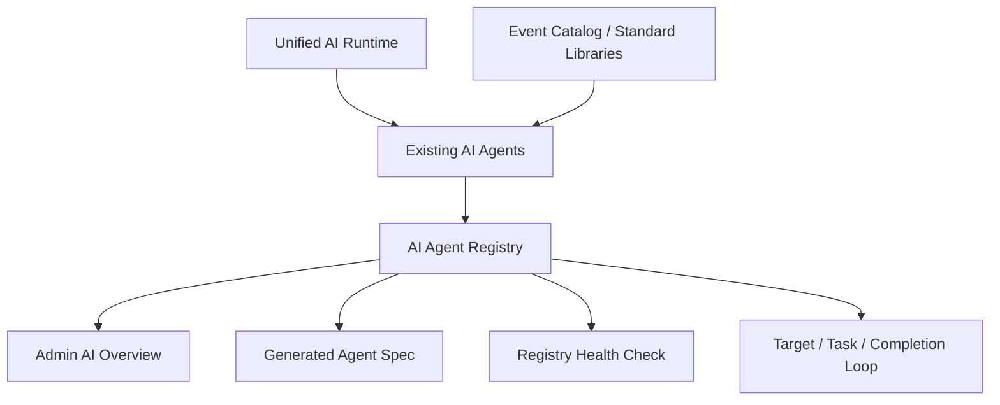

# Design: Agentic AI Operating System

## Architecture

The new layer is a registry, not a new runtime. It describes the AI system that already exists and makes that description executable.



## Registry Shape

Each agent declares:

- identity: id, title, class, product entrance,
- surfaces: API, frontend files, backend files,
- purpose: goal and next improvements,
- prompts: template ids, versions, purposes,
- logic chain: ordered reasoning and execution steps,
- standards: shared catalogs, business libraries, and rules,
- context: indexes, memory tables, profile stores, cache sources,
- output contract: response types or structured JSON contracts,
- validation: guardrails and unsafe-output rejection rules,
- fallback: recovery path when the model fails,
- observability: model status, warnings, sources, audit data,
- evaluation: repeatable check scripts,
- maturity: per-dimension status.

## First Registered Agents

- Event Recommendation Agent
- Hackathon AI Coach
- WeChat Event Parser
- Admin Event Governance Agent
- Model Config and Runtime
- Event AI Profile Index

## Completion Analysis

The registry calculates per-agent maturity and system average maturity. The first target is not 100%; the first target is that every AI surface has:

- a declared logic chain,
- at least one output contract,
- validation,
- fallback,
- repeatable checks,
- next improvements.

## Performance And Accuracy Loop

Live recommendation turns keep the two-stage AI design, but the request path must stay light:

- parse intent through the model with a deterministic standard-library fallback,
- normalize Chinese, English, and pinyin campus/audience/benefit aliases before retrieval,
- retrieve a bounded candidate pool,
- use cached or model-built event profiles when available,
- use transient no-write fallback profiles when the model is skipped or fails during a live turn,
- leave durable profile generation to the background refresh command,
- prove the behavior through golden samples that check ranking quality, fallback quality, and profile-index write avoidance.

## Action Evidence Loop

Borrowing from the education-agent pattern, an AI recommendation is not considered mature just because it produced plausible text. The system should keep a light process signal:

```text
AI recommendation -> user feedback/favorite/registration -> action evidence -> next ranking adjustment
```

For the event recommendation agent, action evidence is observational, not causal:

- recommended event IDs are stored only in anonymous run summaries,
- positive evidence includes thumbs-up feedback, favorites, and event registrations,
- negative evidence includes thumbs-down feedback,
- status uses `OBSERVED`, `PARTIALLY_OBSERVED`, `NOT_OBSERVED`, or `CONTRADICTED`,
- the admin AI overview summarizes action rate and the next adjustment direction.

The same signal also feeds the next recommendation turn in a bounded way:

- user-level favorites, registrations, and feedback are summarized into weighted category and event evidence,
- positive evidence can lift similar candidates and add an explicit action-evidence match signal,
- negative evidence can lower similar candidates unless the user explicitly asks for that activity type,
- the model rerank prompt receives `actionEvidence` per candidate so the large model can reason over personalization instead of guessing from text alone,
- action evidence remains secondary to the current query's explicit date, campus, organizer, benefit, and activity-type intent.

This keeps the agent from optimizing for "sounds smart" only. The product signal becomes whether recommendations led to observable user action while still respecting privacy and avoiding new database tables in this slice.

## Reasoning Trace And Smart Clarification

The recommendation agent should make the model's useful judgment visible without exposing hidden chain-of-thought. Responses include a user-facing `reasoningTrace`:

- intent confidence,
- candidate count,
- top ranking signals,
- weak or missing preference signals,
- whether action evidence influenced ranking,
- whether fallback or historical expansion was used.

When the request is ambiguous, the agent should not stop at a single generic question. It should return:

- a concise clarification question,
- up to four `clarificationOptions`,
- up to three `provisionalRecommendations`,
- a reasoning trace explaining why clarification is useful.

This keeps the conversation moving: the user can answer the question, pick an option, or still inspect temporary recommendations.

## Auto-Update Spec

`npm run agents:spec` generates `docs/ai-agent-operating-system.generated.md` from the registry. Generated docs become the readable spec, while the registry remains the source of truth.

## Safety

The first implementation is additive. It does not migrate data, delete data, change API keys, or alter public request shapes. Existing admin governance keeps its reviewed apply flow and conflict checks.
