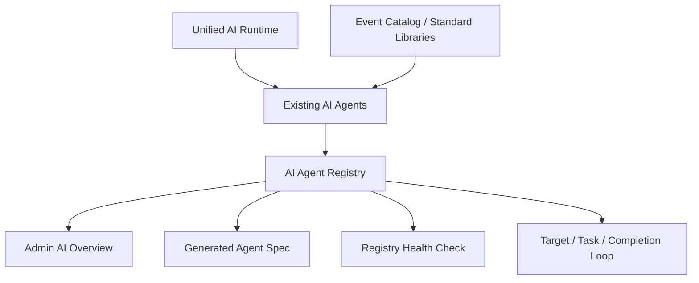

# Design: Agentic AI Operating System

## Architecture

The new layer is a registry, not a new runtime. It describes the AI system that already exists and makes that description executable.

## Registry Shape

Each agent declares:

- identity: id, title, class, product entrance,
- surfaces: API, frontend files, backend files,
- purpose: goal and next improvements,
- prompts: template ids, versions, purposes,
- logic chain: ordered reasoning and execution steps,
- standards: shared catalogs, business libraries, and rules,
- context: indexes, memory tables, profile stores, cache sources,
- output contract: response types or structured JSON contracts,
- validation: guardrails and unsafe-output rejection rules,
- fallback: recovery path when the model fails,
- observability: model status, warnings, sources, audit data,
- evaluation: repeatable check scripts,
- maturity: per-dimension status.

## First Registered Agents

- Event Recommendation Agent
- Hackathon AI Coach
- WeChat Event Parser
- Admin Event Governance Agent
- Model Config and Runtime
- Event AI Profile Index

## Completion Analysis

The registry calculates per-agent maturity and system average maturity. The first target is not 100%; the first target is that every AI surface has:

- a declared logic chain,
- at least one output contract,
- validation,
- fallback,
- repeatable checks,
- next improvements.

## Performance And Accuracy Loop

Live recommendation turns keep the two-stage AI design, but the request path must stay light:

- parse intent through the model with a deterministic standard-library fallback,
- normalize Chinese, English, and pinyin campus/audience/benefit aliases before retrieval,
- retrieve a bounded candidate pool,
- use cached or model-built event profiles when available,
- use transient no-write fallback profiles when the model is skipped or fails during a live turn,
- leave durable profile generation to the background refresh command,
- prove the behavior through golden samples that check ranking quality, fallback quality, and profile-index write avoidance.

## Auto-Update Spec

`npm run agents:spec` generates `docs/ai-agent-operating-system.generated.md` from the registry. Generated docs become the readable spec, while the registry remains the source of truth.

## Safety

The first implementation is additive. It does not migrate data, delete data, change API keys, or alter public request shapes. Existing admin governance keeps its reviewed apply flow and conflict checks.
