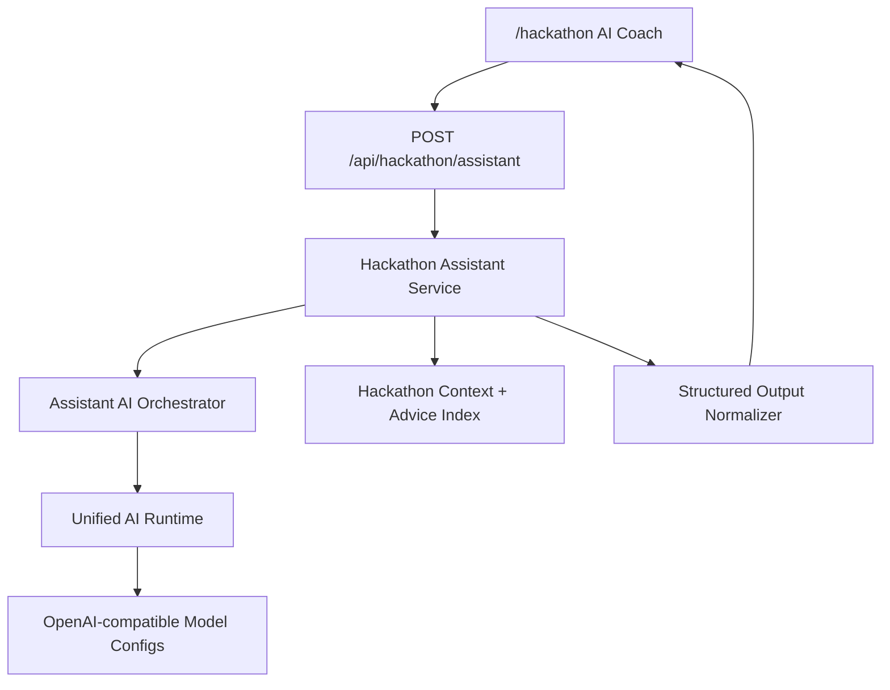

# Smart AI Assistant V2

## Why

The site now has AI-related entrances in activities, admin governance, model configuration, and the hackathon page. The activity assistant has started using a model-backed pipeline, but the overall product still feels uneven: some places show real AI reasoning, while others are only forms, search, or rule output.

The next step is to make every AI-facing feature follow one architecture:

```text
standard context -> intent analysis -> candidate/index retrieval -> model reasoning -> structured validation -> fallback -> observable result
```

For this change, the first concrete product slice is the hackathon page. A hackathon visitor should be able to ask whether they are suitable, what track to choose, how to prepare, how to use AI tools, and what to submit. The answer must come from the same unified large-model runtime, not a hard-coded FAQ.

## Goals

- Add a shared AI orchestration service for assistant-style tasks.
- Keep the existing event assistant runtime stable.
- Add a hackathon AI coach endpoint that uses the large model for intent understanding and advice generation.
- Ground hackathon answers in a local event profile/index so the model is fast, bounded, and specific.
- Show the hackathon AI coach on the hackathon page with visible model status and useful fallback behavior.
- Add service-level checks proving that the assistant calls the AI orchestration path and remains usable when the model fails.

## Non-Goals

- Do not introduce a new vector database in this first slice.
- Do not rewrite the event assistant UI in this change.
- Do not change registration schema or mutate registration records.
- Do not expose API keys in the frontend or commit environment files.
- Do not make the model hallucinate live policies that are not in the hackathon context.

## Impact

- Frontend:
  - Add a compact hackathon AI coach panel to the `/hackathon` page.
  - Display summary, recommended focus, preparation steps, risk notes, and model/fallback status.
- Backend:
  - Add a reusable assistant orchestrator wrapper over `unifiedAiRuntimeService.callJson`.
  - Add a hackathon assistant service and public API route.
  - Reuse the existing ModelScope/OpenAI-compatible configuration and failover.
- Database:
  - No schema change required.
  - Reads public settings to enrich the hackathon context when available.
- AI / standard data:
  - Use a structured hackathon profile and candidate advice cards as a small index.
  - Require strict JSON output with confidence, intent, recommendation, plan, and warnings.
- Deployment:
  - Code-only deployment. Existing model config continues to power the new endpoint.

## Scenarios

### Scenario: Participant asks if they should join

GIVEN a student is on `/hackathon`
WHEN they ask "我不会前端但会用 Codex，适合参加吗"
THEN the assistant identifies their profile, recommends a role/track, gives preparation steps, and explains risks.

### Scenario: User asks about rules or deliverables

GIVEN the user asks about time, tools, deliverables, judging, or prizes
WHEN the assistant answers
THEN it grounds the answer in the hackathon context and avoids inventing unsupported policies.

### Scenario: Model is unavailable

GIVEN the model returns empty content, invalid JSON, rate limit, or all keys fail
WHEN the user asks the hackathon assistant
THEN the endpoint returns a useful fallback plan and clearly marks `fallbackUsed=true`.

## Architecture



## Tasks

- [x] Write this V2 spec and implementation scope.
- [ ] Add shared assistant orchestration helper.
- [ ] Add hackathon assistant service and controller route.
- [ ] Add backend check for success and fallback paths.
- [ ] Add hackathon AI coach UI on `/hackathon`.
- [ ] Run syntax, assistant checks, lint/build, and browser verification.
- [ ] Commit and push only the code/spec files from this change.

## Acceptance

- [ ] `POST /api/hackathon/assistant` returns structured AI advice for realistic hackathon questions.
- [ ] The response includes model status, confidence, intent, recommendation, preparation steps, and grounded context sources.
- [ ] If the model fails, the endpoint still returns useful fallback guidance and marks the fallback clearly.
- [ ] `/hackathon` shows a usable AI coach panel without breaking registration.
- [ ] Existing event assistant checks still pass.
- [ ] Frontend build and lint pass.
