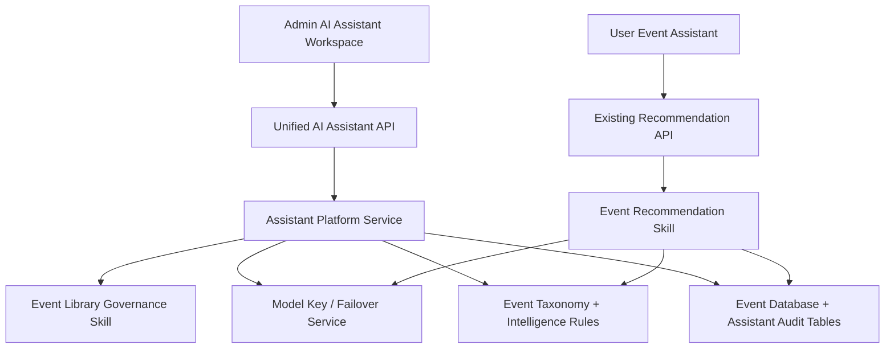

## Context

The application has already built the important ingredients:

- Event taxonomy and classification rules live in the backend.
- User-facing event recommendation already uses activity data, user preferences, assistant memory, and model failover.
- Admin model key management already supports multiple API keys and automatic failover.
- WeChat parsing and event intelligence logic exist but are not presented as part of one assistant system.

The product problem is not only “add another AI page”. The better design is a unified assistant platform with different entrances and skills.

## Goals

- Make the AI assistant visible and understandable in the admin console.
- Give the assistant a shared backend surface instead of scattering AI logic across unrelated controllers.
- Let admins scan and improve the event database before recommending activities to users.
- Keep existing recommendation behavior stable.
- Make the system maintainable as new assistant skills are added.

## Non-Goals

- Do not rebuild the whole recommendation engine in this change.
- Do not require vector search or a new external AI runtime before the first version works.
- Do not automatically rewrite event data without admin confirmation.
- Do not remove the existing model key manager; integrate it.

## Architecture

The assistant is organized as one platform with multiple skills:

### Backend Shape

- `unifiedAiAssistantService`
  - exposes module overview,
  - scans event data through existing taxonomy/intelligence rules,
  - writes run and suggestion records,
  - applies selected suggestions with conflict checks.
- `aiAssistantController`
  - admin-only endpoints for overview, scan, and apply.
- New audit tables
  - `ai_assistant_runs`,
  - `ai_event_governance_suggestions`.

### Frontend Shape

- Admin menu entry becomes `AI 助手`.
- Workspace sections:
  - `总览`: what the assistant can do and what is already connected,
  - `活动治理`: scan, review, and apply database classification suggestions,
  - `模型 Key`: existing key manager,
  - `解析入口`: visible placeholder for future WeChat/content parsing integration.

## Data Flow

1. Admin opens the AI assistant workspace.
2. Workspace loads assistant overview and module health.
3. Admin runs an event governance scan.
4. Backend reads events, classifies and normalizes them using the shared event taxonomy.
5. Backend stores a run record and suggestion records.
6. Admin reviews suggestions and selects which ones to apply.
7. Backend checks whether the event still matches the original value, applies safe updates, and records applied/skipped status.

## Key Decisions

- Start with rule-backed governance, then layer model reasoning later.
  - This gives deterministic, testable improvements immediately.
  - Model calls can be added for low-confidence or ambiguous cases.
- Keep event recommendation API unchanged.
  - The front-facing assistant remains stable while the platform foundation grows.
- Store suggestions instead of directly editing events.
  - This makes the assistant “看得见，摸得着”: admins can see what it found, why it thinks so, and what changed.
- Integrate key management as a module, not a separate product.
  - API keys become the assistant’s model power source rather than a hidden settings island.

## Risks

- Classification confidence can be over-trusted.
  - Mitigation: scan does not mutate data, apply is explicit, low-confidence suggestions stay review-only.
- Admin UI can become too wordy.
  - Mitigation: use compact status cards, direct verbs, and concise rows.
- Future assistant skills can become tangled.
  - Mitigation: use a module registry and skill-like service functions behind one controller surface.
